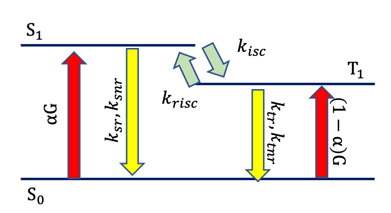
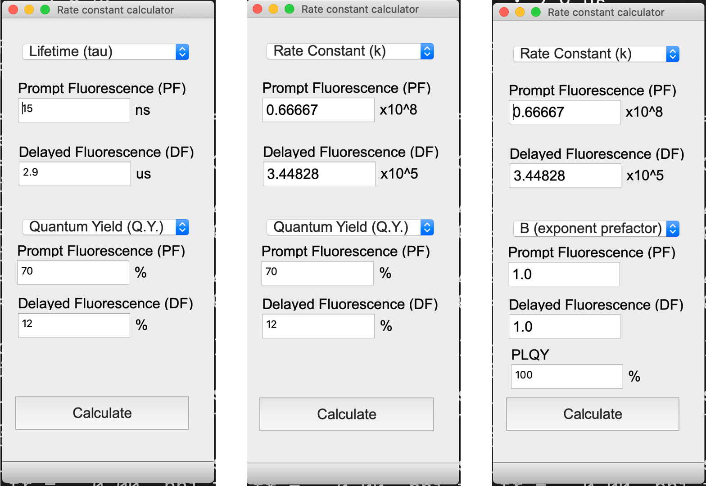
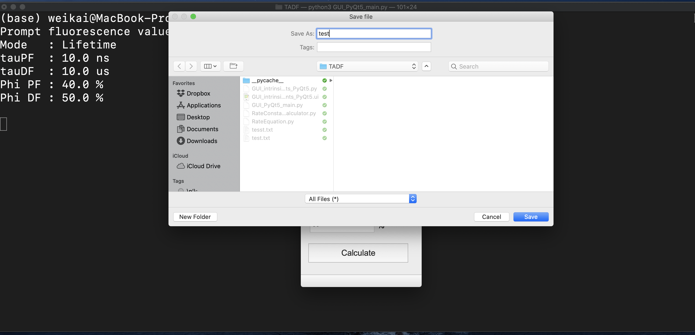
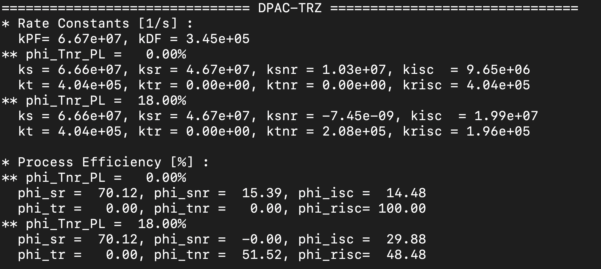
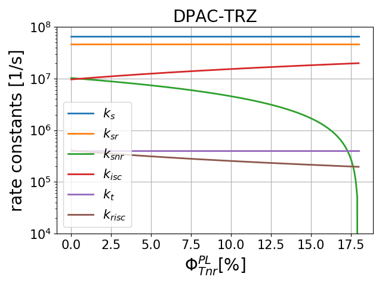
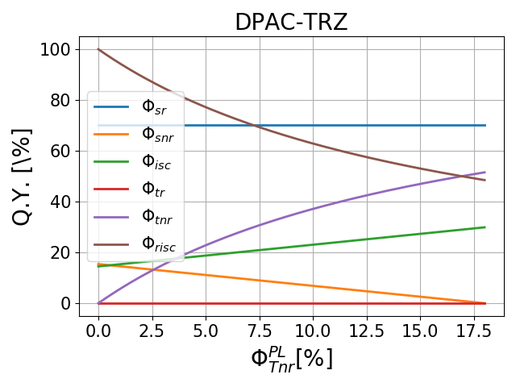

# RateConstants_TADF

A module for extracting intrinsic rate constants in thermally activated delayed fluorescence (TADF) materials with two delayed components.

Prerequisites:
```
pip install numpy matplotlib
```

This module calculates intrinsic rate constants between energy states:
- S0 (ground state)
- S1 (1st excited singlet)
- T1 (1st excited triplet state)

Transitions include:
- S1→S0 (fluorescence and heat loss)
- S1→T1 (intersystem crossing)
- T1→S1 (reverse intersystem crossing)
- T1→S0 (phosphorescence and heat loss)

<p align="center">

</p>

The module also provides TADF material efficiency and exciton concentration calculations.

## Symbols
- PF: Prompt fluorescence
- DF: Delayed fluorescence
- tau: Exciton lifetime
- k: Rate constant

#### Measurables:
- tauPF/tauDF: PF/DF exciton lifetime from transient data
- kPF/kDF: PF/DF rate constant (calculated from tauPF/tauDF)
- PLQY: Photoluminescence quantum yield (thin film)

#### Intrinsic rate constants in S1
- ks: Total rate constant in S1 (ks = ksr + ksnr + kisc)
- ksr: Radiative rate constant in S1
- ksnr: Non-radiative rate constant in S1
- kisc: Intersystem crossing rate constant (S1→T1)

#### Intrinsic rate constants in T1
- kt: Total rate constant in T1 (kt = ktr + ktnr + krisc)
- ktr: Radiative rate constant in T1
- ktnr: Non-radiative rate constant in T1
- krisc: Reverse intersystem crossing rate constant (T1→S1)

#### Quantum yield (Q.Y.)
- phi_PF: PLQY component from PF (PL excitation, thin film)
- phi_DF: PLQY component from DF (PL excitation, thin film)

- phi_sr: Singlet radiative efficiency
- phi_snr: Singlet non-radiative efficiency
- phi_isc: Intersystem crossing efficiency

- phi_tr: Triplet radiative efficiency
- phi_tnr: Triplet non-radiative efficiency
- phi_risc: Reverse intersystem crossing efficiency

- phi_Tnr_PL: Total loss efficiency from triplet state in PL excitation
- phi_Snr_PL: Total loss efficiency from singlet state in PL excitation

#### Prefactor
- B_PF: Prefactor of PF
- B_DF: Prefactor of DF

#### Purcell Effect
F: Purcell factor
IQE = (PLQY * F/((1-PLQY)+PLQY * F)) * (alpha + phi_risc * (1-alpha))
where:
- alpha = 1.00 for PL excitation
- alpha = 0.25 for EL excitation

## rate_constants_calculator Module

```python
import rate_constants_calculator as rcc
```

#### Utility Functions
```python
rcc.tau2k(tau)          # Calculate rate constant from lifetime
rcc.k2tau(k)            # Calculate lifetime from rate constant
rcc.cal_exponential_ratio(tau_Array, B_Array)      # Calculate relative ratio of each exponent
rcc.cal_phi_PF_DF(PLQY, tauPF, tauDF, B_PF, B_DF)  # Calculate quantum efficiency from PF and DF
```

#### Intrinsic Rate Constant Calculator
`rcc.cal_determined_intrinsic_rate_constants(kPF, kDF, phi_PF, phi_DF)`  
Calculates intrinsic rate constants that can be determined by kPF, kDF, phi_PF, and phi_DF.  
These four values can be directly extracted from transient data and PLQY.

```python
kPF = rcc.tau2k(tauPF)
kDF = rcc.tau2k(tauDF) 
    
[phi_PF, phi_DF] = rcc.cal_phi_PF_DF(PLQY, tauPF, tauDF, B_PF, B_DF)
ksr, ks, kt, kisckrisc = rcc.cal_determined_intrinsic_rate_constants(kPF, kDF, phi_PF, phi_DF)
```

Output: ksr, ks, kt, kisckrisc (product of the intersystem rate constant and reverse intersystem crossing rate constant)

`rcc.cal_intrinsic_rate_constants(kPF, kDF, phi_PF, phi_DF, phi_Tnr_PL)`  
Calculates rate constants that cannot be directly determined from experimental data, considering loss ratio from triplet state by PL excitation (phi_Tnr_PL), a value between 0 and 1-PLQY.
- phi_Tnr_PL=0: all loss is from singlet state
- phi_Tnr_PL=1-PLQY: all loss is from triplet state

```python
import numpy as np
phi_Tnr_PL = np.linspace(0, 1-PLQY, 200)
ks, ksr, ksnr, kisc, kt, ktr, ktnr, krisc = rcc.cal_intrinsic_rate_constants(kPF, kDF, phi_PF, phi_DF, phi_Tnr_PL)
```

#### Efficiency Functions
`rcc.cal_phi_sr_snr_isc(ksr, ksnr, kisc)`  
Calculates efficiency of each process in S1.  
Output: phi_sr, phi_snr, phi_isc

`rcc.cal_phi_tr_tnr_risc(ktr, ktnr, krisc)`  
Calculates efficiency of each process in T1.  
Output: phi_tr, phi_tnr, phi_risc

#### Internal Quantum Efficiency (IQE)
`rcc.cal_IQE_enhanced_by_Purcell_effect(IQE, F=1.0)`  
Calculates internal quantum yield considering the Purcell effect.

`rcc.cal_IQE_from_rate_constants(ksr, kt, krisc, kPF, kDF, alpha=1.0, F=1.0)`  
Calculates internal quantum yield considering the Purcell effect.

`rcc.cal_IQE_from_phi(phi_sr, phi_isc, phi_risc, alpha=1.0, F=1.0)`  
Calculates internal quantum efficiency using intrinsic state efficiency.

`rcc.cal_IQE_from_PLQY(phi_risc, PLQY, alpha=1.0, F=1.0)`  
Calculates internal quantum efficiency from PLQY.

`rcc.cal_PLQY_from_phi(phi_sr, phi_isc, phi_risc)`  
Calculates PLQY from intrinsic state efficiency.

#### Differential Equations
`rcc.cal_k_total(kr, knr, kisc)`  
Calculates total rate constant in a state.

`rcc.cal_kPF_kDF(ksr, ksnr, kisc, ktr, ktnr, krisc, F=1.0)`  
Calculates kPF and kDF from intrinsic rate constants considering the Purcell effect.  
Output: kPF, kDF

`rcc.cal_steady_state_exciton_concentration(ksr, ksnr, kisc, ktr, ktnr, krisc, alpha=1.0, G=1.0, F=1.0)`  
Calculates steady state S1 and T1 exciton concentration.  
G: total exciton generation rate (i.e., S1+T1)  
Output: ratio

`rcc.cal_steady_state_exciton_concetration_ratio(ksr, ksnr, kisc, ktr, ktnr, krisc, alpha=1.0, G=1.0, F=1.0)`  
Calculates steady state concentration ratio between T1 and S1 (T1/S1).  
Output: S1_SS, T1_SS

`rcc.cal_pulse_response(t, ksr, ksnr, kisc, ktr, ktnr, krisc, alpha=1.0, G=1.0, F=1.0)`  
Calculates time evolution of S1 and T1 concentration.  
Output: S1_t, T1_t, caches  
caches = (ks, kt, ks, kt, S10, T10, V_PF, V_DF)  
V_PF and V_DF are characteristic vectors for PF and DF, respectively.

#### Scripts
`rcc.script_for_100_PLQY(tau_PF, tau_DF, phi_PF, phi_DF, name='')`  
Analyzer for PLQY=100%

`rcc.script(tau_PF, tau_DF, phi_PF, phi_DF, fpath='', fname='')`  
Analyzer for PLQY not equal to 100%

`rcc.pulse_response_script(t, ksr, ksnr, kisc, ktr, ktnr, krisc, alpha=1.0, G=1.0, name='')`  
Time evolution calculator

Example:

```python
# Calculate intrinsic rate constants
# SpiroAC-TRZ
rcc.script_for_100_PLQY(tau_PF=17e-9, tau_DF=2.1e-6, phi_PF=0.79, phi_DF=0.21, name='SpiroAC-TRZ')
    
# DPAC-TRZ
rcc.script(tau_PF=15e-9, tau_DF=2.9e-6, phi_PF=0.70, phi_DF=0.12, fname='DPAC-TRZ', fpath='./data')
    
# DMAC-TRZ
rcc.script(tau_PF=20e-9, tau_DF=1.9e-6, phi_PF=0.59, phi_DF=0.31, fname='DMAC-TRZ', fpath='./data')
    
# Calculate pulse response
# SpiroAC-TRZ
t = np.linspace(0, 10e-6, 1024)
ksr, ksnr, kisc = 4.66e7, 0, 1.21e7
ktr, ktnr, krisc = 0, 0, 6.01e5 
    
name = r'SpiroAC-TRZ $\alpha = 1.0$'
rcc.pulse_response_script(t, ksr, ksnr, kisc, ktr, ktnr, krisc, alpha=1.0, G=1e4, name=name)
    
name = r'SpiroAC-TRZ $\alpha = 0.25$'
rcc.pulse_response_script(t, ksr, ksnr, kisc, ktr, ktnr, krisc, alpha=0.25, G=1e4, name=name)
```

## GUI 

The graphic user interface is built with PyQt5:

```
pip install PyQt5
```

Run the GUI with:

```
python GUI_PyQt5_main.py
```

<p align="center">

</p>

### Usage Steps

1. Select lifetime or rate constant input mode.

2. Input measured parameters:
   - Lifetimes (tau)/rate constants (k) of prompt and delayed fluorescence
   - Quantum yields or prefactors and PLQY

3. Calculate results:
   - Select save file path and name
   <p align="center">
   
   </p>

4. View results:
   - Terminal displays summaries for different loss cases
   <p align="center">
   
   </p>
   
   - Saved output includes:
     - Text file with data
     - Rate constants vs. loss from T1 plot
     <p align="center">
     
     </p>
     
     - Quantum yield vs. loss from T1 plot
     <p align="center">
     
     </p>

## Project Structure
```
RateConstants_TADF/
├── src/                   # Source code
│   ├── rate_constants_calculator.py # analytical solutions
│   └── numerical_rate_equation.py   # numerical differential rate equations
├── gui/                   # graphic user interface
│   ├── pyqt5/             # PyQt5 GUI
|   └── html/              # html GUI
├── image/                # Documentation and images
├── data/                 # Example data and results
└── README.md             # documentation
```

## References
[1] [Efficient and Tunable Thermally Activated Delayed Fluorescence Emitters Having Orientation-Adjustable CN-Substituted Pyridine and Pyrimidine Acceptor Units](https://onlinelibrary.wiley.com/doi/abs/10.1002/adfm.201602501)

[2] [Sky-Blue Organic Light Emitting Diode with 37% External Quantum Efficiency Using Thermally Activated Delayed Fluorescence from Spiroacridine-Triazine Hybrid](https://onlinelibrary.wiley.com/doi/abs/10.1002/adma.201601675)

[3] [A versatile thermally activated delayed fluorescence emitter for both highly efficient doped and non-doped organic light emitting devices](https://pubs.rsc.org/no/content/articlelanding/2015/cc/c5cc05022g/unauth#!divAbstract)

[4] [Achieving Nearly 30% External Quantum Efficiency for Orange–Red Organic Light Emitting Diodes by Employing Thermally Activated Delayed Fluorescence Emitters Composed of 1,8-Naphthalimide-Acridine Hybrids](https://onlinelibrary.wiley.com/doi/abs/10.1002/adma.201704961)

