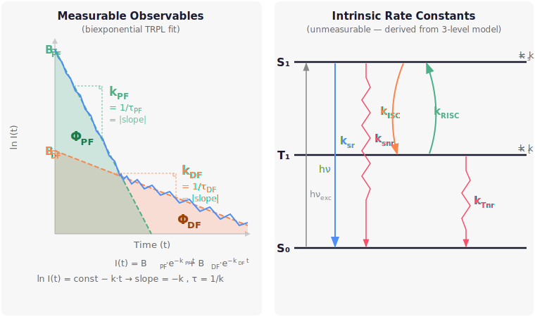
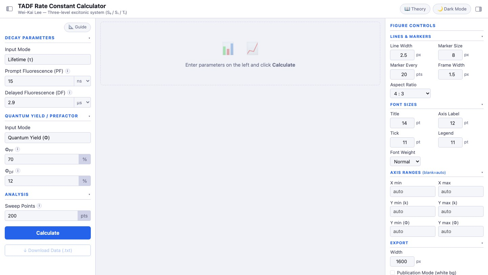
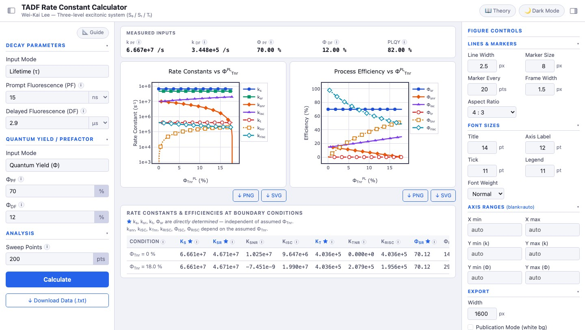
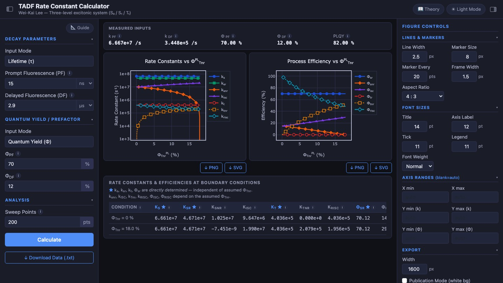

# TADF Rate Constant Calculator

**Author:** Wei-Kai Lee
**Model:** Three-level excitonic system (S₀ / S₁ / T₁)

An interactive web application for extracting all intrinsic rate constants and process efficiencies of a TADF emitter from two experimental observables: the biexponential **TRPL decay lifetimes** (τ_PF, τ_DF) and the **photoluminescence quantum yields** (Φ_PF, Φ_DF).

---

## What it calculates

A TADF emitter has 5 intrinsic rate constants (k_sr, k_snr, k_isc, k_tr, k_risc) but standard TRPL + PLQY measurements only fix 4 quantities. The calculator resolves the underdetermined system by sweeping the free parameter **Φ_Tnr** (triplet non-radiative loss fraction), producing a complete curve of solutions — the physically meaningful result is the full envelope, not a single point.



The **left panel** shows what you measure experimentally: a biexponential TRPL decay on a log scale, where the fast slope gives k_PF (= 1/τ_PF) and the slow slope gives k_DF (= 1/τ_DF), and the shaded areas correspond to Φ_PF and Φ_DF. The **right panel** shows the five intrinsic rate constants of the three-level model (S₀/S₁/T₁) that this calculator extracts from those four observables.

**Outputs:**
- k_s, k_sr, k_snr, k_isc — singlet manifold rate constants
- k_t, k_tr, k_tnr, k_risc — triplet manifold rate constants
- Φ_sr, Φ_snr, Φ_isc, Φ_tr, Φ_tnr, Φ_risc — process efficiencies (%)
- Summary table at boundary conditions (Φ_Tnr = 0 and Φ_Tnr = max)
- Downloadable `.txt` data file

---

## Installation

### Option A — Python environment (recommended for development)

**Requirements:** Python 3.9+, `numpy`, `flask`

```bash
# Clone the repository
git clone https://github.com/d04943016/RateConstants_TADF.git
cd TADF

# Install dependencies
pip install flask numpy

# Launch
python3 src/ui/flask_web/app.py
# → Browser opens automatically at http://127.0.0.1:5001
```

Or double-click **`launch.command`** on macOS — it sources `~/.zshrc` to pick up your conda/pyenv environment, starts the server, and opens the browser automatically.

### Option B — Standalone `.app` (macOS, no Python required)

Build a self-contained application bundle using PyInstaller:

```bash
# One-time setup
pip install pyinstaller

# Build (~30 s)
python3 build_app.py

# The app is at:
#   dist/TADF Calculator.app
```

Double-click `dist/TADF Calculator.app` to launch. The browser opens automatically when the server is ready. Closing the browser tab shuts the server down automatically.

> **Note:** The first launch may take 5–10 s as macOS scans the bundle (Gatekeeper). Subsequent launches are faster.

### Configuration

`src/ui/flask_web/config/config.json` controls server settings:

```json
{
  "host": "0.0.0.0",
  "port": 5001,
  "debug": true,
  "output_dir": "data/output"
}
```

---

## Usage

### 1 · Enter decay parameters



The **left sidebar** contains all inputs, grouped into three collapsible sections:

| Section | Purpose |
|---|---|
| **Decay Parameters** | Lifetimes τ_PF (ns) and τ_DF (µs), or rate constants k_PF / k_DF. Toggle with *Input Mode*. |
| **Quantum Yield / Prefactor** | Φ_PF and Φ_DF in %, or B-prefactors + total PLQY if you measured the biexponential amplitudes. Toggle with *Input Mode*. |
| **Analysis** | Number of sweep points for the Φ_Tnr parameter scan (default 200). |

Click **Calculate** when ready.

---

### 2 · Read the results



After calculation, the center panel shows:

**Measured Inputs bar** — echoes the derived k_PF, k_DF, Φ_PF, Φ_DF, and PLQY so you can verify unit conversions at a glance.

**Rate Constants vs Φ_Tnr** *(left chart)* — all 8 rate constants on a log scale as a function of the assumed triplet non-radiative loss. The x-axis sweeps from Φ_Tnr = 0 (no triplet non-radiative loss) to Φ_Tnr = max (all remaining loss in triplets). Starred quantities (k_s, k_sr, k_t, k_tr) are directly determined — they appear as horizontal lines independent of Φ_Tnr.

**Process Efficiency vs Φ_Tnr** *(right chart)* — the six quantum efficiencies (Φ_sr, Φ_snr, Φ_isc, Φ_tr, Φ_tnr, Φ_risc) over the same sweep range.

**Rate Constants & Efficiencies at Boundary Conditions** — summary table at Φ_Tnr = 0% and Φ_Tnr = max%, giving the full solution at each extreme of the envelope.

**Download Data (.txt)** — exports all sweep data as a space-delimited text file.

---

### 3 · Dark mode



Click **Dark Mode / Light Mode** in the header to toggle. The theme applies to both the UI and the Plotly chart colors.

---

### 4 · Figure Controls (right sidebar)

The right panel gives publication-ready figure customization without leaving the browser:

| Control group | Options |
|---|---|
| **Lines & Markers** | Line width, marker size, marker density, frame width, aspect ratio |
| **Font Sizes** | Title, axis label, tick, legend font sizes and weight |
| **Axis Ranges** | Manual x/y range override (leave blank for auto) |
| **Export** | Export width in px; **Publication Mode** switches to white background + black text suitable for journal figures |
| **Trace Styles** | Per-trace visibility checkbox, color picker, and marker symbol selector |

**PNG** and **SVG** export buttons appear below each chart.

---

### 5 · Guide & Theory

- **Guide** *(top of input panel)* — opens an annotated diagram of the three-level model and the TRPL biexponential decay, explaining what each measured quantity corresponds to physically.
- **Theory** *(top-right header)* — physical description of the model, how rate constants are extracted, what the Φ_Tnr sweep represents, and literature references.

---

## Project structure

```
TADF/
├── src/
│   ├── engine/
│   │   ├── calculator.py        # Core calculation engine
│   │   └── rate_equation.py     # Rate equation solver
│   └── ui/
│       └── flask_web/
│           ├── app.py           # Flask server + API endpoints
│           ├── config/
│           │   └── config.json  # Server configuration
│           └── templates/
│               └── index.html   # Single-page web UI
├── docs/
│   └── screenshots/             # UI screenshots (for documentation)
├── build_app.py                 # PyInstaller build script (macOS .app)
├── launch.command               # macOS double-click launcher
└── README.md
```

---

## Core Engine (Python API)

```python
import sys
sys.path.insert(0, '/path/to/TADF')
from src.engine import calculator as engine
import numpy as np

kPF, kDF = engine.tau2k([15e-9, 2.9e-6])

phi_Tnr = np.linspace(0, 0.18, 200)
ks, ksr, ksnr, kisc, kt, ktr, ktnr, krisc = engine.cal_intrinsic_rate_constants(
    kPF, kDF, phi_PF=0.70, phi_DF=0.12, phi_Tnr_PL=phi_Tnr
)
```

---

## References

1. K.-C. Pan, S.-W. Li, Y.-Y. Ho, Y.-J. Shiu, W.-L. Tsai, M. Jiao, W.-K. Lee, C.-C. Wu et al., "Efficient and Tunable Thermally Activated Delayed Fluorescence Emitters Having Orientation-Adjustable CN-Substituted Pyridine and Pyrimidine Acceptor Units," *Adv. Funct. Mater.* **2016**, *26*, 7560–7571. https://doi.org/10.1002/adfm.201602501
2. T.-A. Lin, T. Chatterjee, W.-L. Tsai, W.-K. Lee, M.-J. Wu, M. Jiao, K.-C. Pan, C.-L. Yi, C.-L. Chung, K.-T. Wong, C.-C. Wu, "Sky-Blue Organic Light Emitting Diode with 37% External Quantum Efficiency Using Thermally Activated Delayed Fluorescence from Spiroacridine-Triazine Hybrid," *Adv. Mater.* **2016**, *28*, 6976–6983. https://doi.org/10.1002/adma.201601675
3. W.-L. Tsai, M.-H. Huang, W.-K. Lee, Y.-J. Hsu, K.-C. Pan, Y.-H. Huang, H.-C. Ting, M. Sarma, Y.-Y. Ho, H.-C. Hu, C.-C. Chen, M.-T. Lee, K.-T. Wong, C.-C. Wu, "A versatile thermally activated delayed fluorescence emitter for both highly efficient doped and non-doped organic light emitting devices," *Chem. Commun.* **2015**, *51*, 13662–13665. https://doi.org/10.1039/C5CC05022G
4. W. Zeng, H.-Y. Lai, W.-K. Lee, M. Jiao, Y.-J. Shiu, C. Zhong, S. Gong, T. Zhou, G. Xie, M. Sarma, K.-T. Wong, C.-C. Wu, C. Yang, "Achieving Nearly 30% External Quantum Efficiency for Orange–Red Organic Light Emitting Diodes by Employing Thermally Activated Delayed Fluorescence Emitters Composed of 1,8-Naphthalimide-Acridine Hybrids," *Adv. Mater.* **2018**, *30*, 1704961. https://doi.org/10.1002/adma.201704961

---

Copyright © Wei-Kai Lee. All rights reserved.
