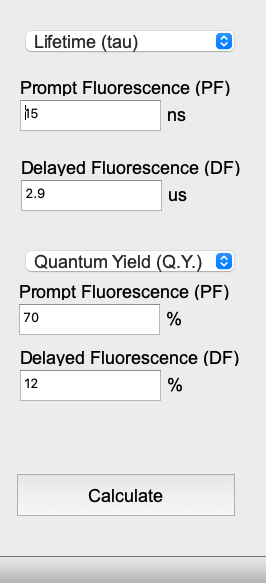

# TADF Rate Constant Calculator — PyQt5 Desktop UI

A lightweight native desktop application for extracting TADF rate constants from TRPL + PLQY measurements. Results are saved directly to a file you choose.

> For the full interactive web UI (with charts and sweep visualization), see the **Flask UI** at `src/ui/flask_web/`.

---

## Installation

Requires Python 3.9+ and the following packages:

```bash
pip install PyQt5 numpy matplotlib
```

Or install from the requirements file:

```bash
pip install -r src/ui/pyqt5/requirements.txt
```

---

## Launch

Run from the **project root**:

```bash
python3 src/ui/pyqt5/main.py
```

---

## Usage



The window has two input sections and a Calculate button.

### Decay Parameters (top)

Select input mode from the dropdown:

| Mode | PF field | DF field |
|---|---|---|
| **Lifetime (τ)** | τ_PF in **ns** | τ_DF in **μs** |
| **Rate Constant (k)** | k_PF in **×10⁸ s⁻¹** | k_DF in **×10⁵ s⁻¹** |

Default: τ_PF = 15 ns, τ_DF = 2.9 μs.

### Quantum Yield / Prefactor (middle)

Select input mode from the second dropdown:

| Mode | PF field | DF field | Extra |
|---|---|---|---|
| **Quantum Yield (Q.Y.)** | Φ_PF in **%** | Φ_DF in **%** | — |
| **B (exponent prefactor)** | B_PF | B_DF | PLQY in **%** |

Default: Φ_PF = 70 %, Φ_DF = 12 %.

### Calculate

Click **Calculate** → a file save dialog opens. Choose a folder and filename. The app saves the full calculation results (rate constants, process efficiencies, and the Φ_Tnr sweep) to that location.

Output files are saved to `data/output/` by default (configurable in `config/config.json`).

---

## Configuration

`config/config.json`:

```json
{
  "default_output_dir": "data/output",
  "window_title": "Rate Constant Calculator"
}
```

| Key | Description |
|---|---|
| `default_output_dir` | Default folder shown in the save dialog (relative to project root) |
| `window_title` | Window title bar text |

---

## Output

The saved file contains the full Φ_Tnr parameter sweep with all 8 rate constants and 6 process efficiencies at each point. See the **Flask UI** or **Theory** section for an explanation of the physical meaning of each quantity.
